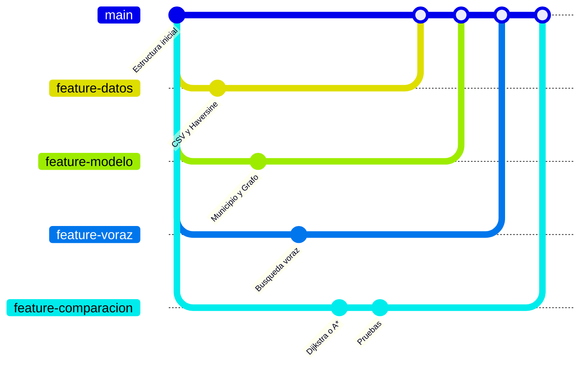

# Búsqueda voraz entre 20 municipios de Colombia

Proyecto en equipo que modela 20 municipios de Colombia como un grafo e implementa la **búsqueda voraz (greedy best-first search)** para encontrar una ruta entre un municipio de origen y uno de destino, usando como heurística la **distancia en línea recta**. Los resultados se comparan con un algoritmo que sí garantiza la ruta óptima (Dijkstra o A*).

---

## Tabla de contenido

1. [Descripción y objetivo](#1-descripción-y-objetivo)
2. [Cómo funciona](#2-cómo-funciona)
3. [Municipios seleccionados](#3-municipios-seleccionados)
4. [Estructura del repositorio](#4-estructura-del-repositorio)
5. [Formato de los datos](#5-formato-de-los-datos)
6. [Cómo compilar y ejecutar](#6-cómo-compilar-y-ejecutar)
7. [Equipo y división del trabajo](#7-equipo-y-división-del-trabajo)
8. [Flujo de ramas y trabajo en Git](#8-flujo-de-ramas-y-trabajo-en-git)
9. [Convenciones](#9-convenciones)
10. [Fuentes de los datos](#10-fuentes-de-los-datos)
11. [Estado del proyecto](#11-estado-del-proyecto)

---

## 1. Descripción y objetivo

Dado un municipio de origen **A** y un municipio de destino **B**, el programa debe:

- Encontrar una ruta de A a B usando búsqueda voraz.
- Mostrar la ruta, los nodos visitados y la distancia total recorrida por carretera.
- Compararla con la ruta óptima para analizar cuándo y por qué la búsqueda voraz falla.

## 2. Cómo funciona

- **Grafo:** cada municipio es un nodo. Cada arista une dos municipios conectados directamente por una carretera principal (sin pasar por otro municipio de la lista) y guarda los kilómetros por carretera.
- **Heurística h(n):** distancia en línea recta desde el nodo n hasta el destino. No se anota a mano: se calcula con la **fórmula de Haversine** a partir de la latitud y la longitud de cada municipio.
- **Búsqueda voraz:** en cada paso expande el nodo de la frontera con menor h(n). Lleva un conjunto de nodos visitados y un registro del nodo anterior para reconstruir la ruta.
- **Limitación conocida:** la búsqueda voraz no garantiza la ruta óptima ni evita los callejones sin salida. Por eso se compara con Dijkstra o A*.

## 3. Municipios seleccionados

| Zona | Municipios |
|---|---|
| Caribe | Barranquilla (Atlántico), Cartagena (Bolívar), Santa Marta (Magdalena), Valledupar (Cesar), Montería (Córdoba) |
| Occidente y Eje Cafetero | Medellín (Antioquia), Manizales (Caldas), Pereira (Risaralda), Armenia (Quindío), Cali (Valle del Cauca) |
| Centro y Nororiente | Soacha (Cundinamarca), Tunja (Boyacá), Bucaramanga (Santander), Cúcuta (Norte de Santander), Barrancabermeja (Santander) |
| Sur y Llanos | Villavicencio (Meta), Ibagué (Tolima), Neiva (Huila), Popayán (Cauca), Pasto (Nariño) |

## 4. Estructura del repositorio

```
busqueda-voraz-municipios/
├── README.md
├── .gitignore
├── data/                  archivos CSV con municipios y conexiones
│   ├── municipios.csv
│   └── conexiones.csv
├── docs/                  guía de trabajo, informe y presentación
└── src/main/java/
    ├── modelo/            Municipio, Grafo
    ├── datos/             lector de los archivos CSV
    ├── algoritmos/        CalculadoraDistancia, BusquedaVoraz, comparación
    └── ui/                Main y menú de consola
```

## 5. Formato de los datos

**`data/municipios.csv`**

| Columna | Descripción |
|---|---|
| `nombre` | Nombre del municipio |
| `departamento` | Departamento |
| `zona` | Zona a la que pertenece en la lista |
| `latitud` | Grados decimales (norte positivo) |
| `longitud` | Grados decimales (oeste negativo) |
| `fuente` | De dónde se sacaron las coordenadas |

Ejemplo:
```
Santa Marta,Magdalena,Caribe,11.2472,-74.2017,Alcaldía Distrital de Santa Marta
```

**`data/conexiones.csv`**

| Columna | Descripción |
|---|---|
| `municipio1` | Un extremo de la conexión |
| `municipio2` | El otro extremo (la conexión se lee en ambos sentidos) |
| `km` | Kilómetros por carretera |
| `fuente` | Origen del dato |

Ejemplo:
```
Santa Marta,Barranquilla,106,Google Maps
```

**Convención de números:** en los CSV del repositorio las columnas se separan con coma y los decimales llevan **punto**. La hoja compartida de Google Sheets usa coma decimal, así que antes de subir los archivos hay que exportarlos desde una copia con configuración regional de Estados Unidos, o reemplazar las comas decimales por puntos. Cada conexión aparece **una sola vez**.

## 6. Cómo compilar y ejecutar

Requisitos: JDK 17 o superior (ajustar si el curso exige otra versión). Verifica con `java -version`.

Desde la raíz del repositorio:

```bash
mkdir -p out
javac -d out $(find src/main/java -name "*.java")
java -cp out ui.Main
```

> Estas instrucciones se actualizarán cuando el código esté listo.

## 7. Equipo y división del trabajo

| Integrante | Usuario de GitHub | Rol |
|---|---|---|
| Juliana | @JuliGR05 | ________________ |
| ________________ | @________ | ________________ |
| ________________ | @________ | ________________ |
| ________________ | @________ | ________________ |

**Parte común (todos):** cada integrante escoge 5 municipios, consigue sus coordenadas y las conexiones con sus vecinos directos (con los km por carretera) y los sube a la hoja compartida. Después redacta su sección del informe.

| Rol | Responsabilidades | Rama |
|---|---|---|
| **Datos y distancias** | Consolidar las hojas en los CSV, verificar que el grafo quede conectado, implementar Haversine | `feature-datos` |
| **Estructura e interfaz** | Clases `Municipio` y `Grafo`, lector de CSV, menú de consola | `feature-modelo` |
| **Búsqueda voraz** | `BusquedaVoraz` con frontera, visitados y casos límite; pseudocódigo | `feature-voraz` |
| **Comparación, pruebas e informe** | Dijkstra o A*, casos de prueba, tabla de resultados, unificar el informe y la presentación | `feature-comparacion` y `docs-informe` |

**Quién necesita qué de quién**

| De | Para | Qué |
|---|---|---|
| Todos | Datos y distancias | Coordenadas y conexiones de sus 5 municipios |
| Datos y distancias | Estructura e interfaz | Archivos CSV y su formato |
| Datos y distancias | Búsqueda voraz | Método de Haversine |
| Estructura e interfaz | Búsqueda voraz y comparación | Clases `Municipio` y `Grafo` (versión básica al inicio) |
| Búsqueda voraz | Estructura e interfaz | Clase de búsqueda para conectar al menú |
| Todos | Comparación, pruebas e informe | Su sección del informe |

## 8. Flujo de ramas y trabajo en Git

- **`main`:** versión estable. Nadie hace push directo a `main`.
- **Una rama por responsabilidad**, creada desde `main`, con los nombres de la tabla anterior.
- Cuando una parte está lista, se abre un **Pull Request** hacia `main` y otro integrante lo revisa antes de mezclarlo.



**Pasos para trabajar**

```bash
git checkout main
git pull                                # traer lo último antes de empezar
git checkout -b feature-voraz           # crear tu rama (o cambiar a ella)
# ...programar...
git add .
git commit -m "Agrega búsqueda voraz con conjunto de visitados"
git push -u origin feature-voraz        # subir la rama
# en GitHub: abrir Pull Request hacia main y pedir revisión
```

Después de mezclar, se actualiza la rama local con `git pull` en `main`.

## 9. Convenciones

- **Commits:** en español, en imperativo y con mensajes claros ("Agrega clase Municipio"). Commits pequeños y frecuentes.
- **Java:** clases en `PascalCase`, métodos y variables en `camelCase`, comentarios Javadoc en los métodos públicos.
- **Distancias:** siempre en kilómetros.
- **Firma del método de búsqueda acordada:** `List<Municipio> buscar(Municipio origen, Municipio destino)`.
- **Archivos generados** (`out/`, archivos de IDE) no se suben; están en el `.gitignore`.

## 10. Fuentes de los datos

- **Coordenadas:** páginas oficiales de alcaldías y gobernaciones. Si no había, Google Maps o Wikipedia. Cada fila de `municipios.csv` indica su fuente.
- **Kilómetros por carretera:** Google Maps, ruta principal entre los dos municipios.

## 11. Estado del proyecto

- [ ] Los 20 municipios tienen coordenadas y conexiones en la hoja compartida
- [ ] CSV consolidados en `data/`
- [ ] Modelo del grafo y lector de datos
- [ ] Haversine
- [ ] Búsqueda voraz
- [ ] Algoritmo de comparación (Dijkstra o A*)
- [ ] Interfaz de consola
- [ ] Casos de prueba y tabla de resultados
- [ ] Informe
- [ ] Presentación
